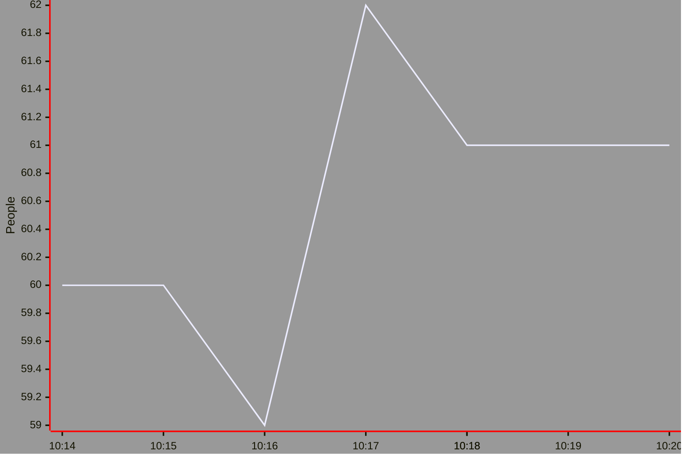

# Schwimmbad Wien: Metric
This small project allows to collect data and create metrics on how many people are in the swimming pool.
It is gathering numbers once a minute from a website and stores it in this repository.

This is a test graph:

