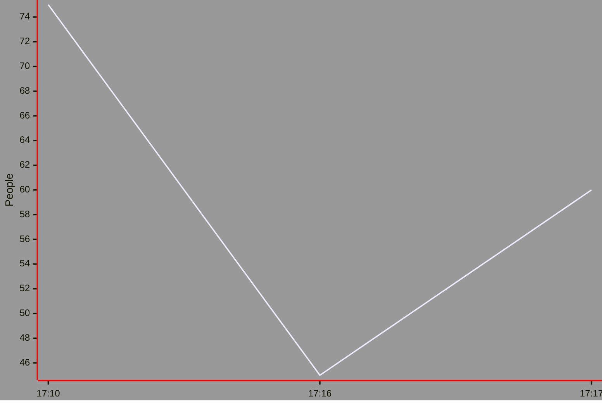

```mermaid
---
config: 
  xyChart: 
    width: 900 
    height: 600 
    showDataLabel: true
    showTitle: false
  themeVariables: 
    xyChart:
      backgroundColor: "#999999"
      titleColor: "#ff0000"
      xAxisLineColor: "#ff0000"
      yAxisLineColor: "#ff0000"
---
xychart-beta
  title "Stadthallenbad"
  x-axis ["17:10", "17:16", "17:17"]
  y-axis "People"
  line [75, 45, 60]
```